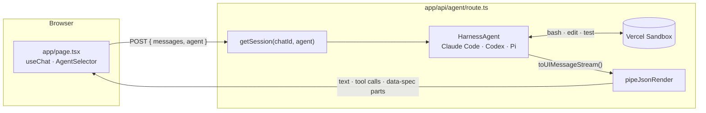
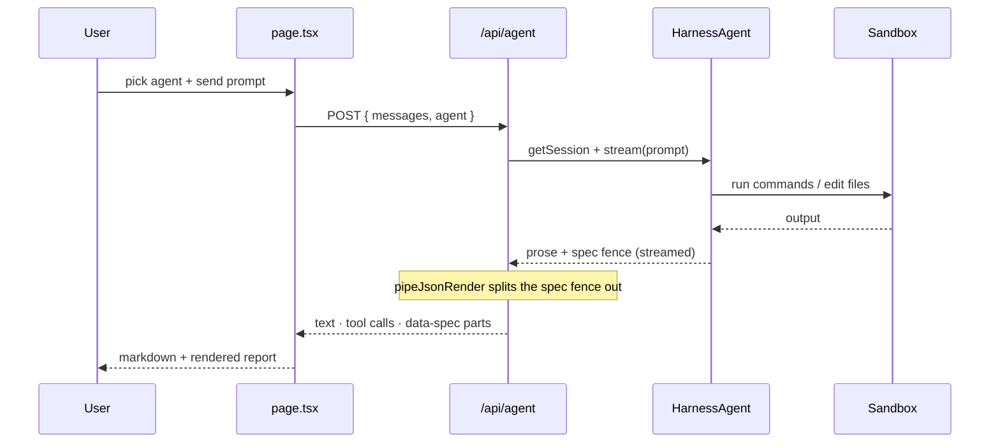

# Harness Agent Chat Example

**json-render as the UI for agent harnesses.**

This example runs a real coding agent -- pick **Claude Code**, **Codex**, or **Pi** -- in a Vercel Sandbox, driven through the AI SDK 7 [`HarnessAgent`](https://vercel.com/changelog/program-agent-harnesses-with-ai-sdk) API, and renders its work as generative UI instead of a wall of markdown.

The agent edits files, runs commands, and executes tests inside the sandbox. When it reports back, it emits a json-render spec constrained to a catalog of work-report components (`Steps`, `FileChange`, `Terminal`, `TestResults`, `Metric`, `BarChart`, `LineChart`, ...), which streams into the chat as structured, rendered UI.

## How it works

The round trip: the browser posts the chosen agent and prompt, the server streams a harness turn, and `pipeJsonRender` extracts the spec fence on the way back.



What happens on a single turn:



1. `lib/agents.ts` is a client-safe catalog of the selectable agents; `lib/agent.ts` builds a `HarnessAgent` per agent (Claude Code, Codex, or Pi), each with a Vercel sandbox provider. The shared `instructions` embed `agentReportCatalog.prompt({ mode: "inline" })`, teaching the runtime to wrap its UI report in a ` ```spec ` fence.
2. `app/api/agent/route.ts` reads the chosen `agent` from the request body and keeps one live harness session per chat, locked to the agent that created it (the harness owns its own conversation history, so each turn sends only the fresh user message). It streams the turn and pipes it through `pipeJsonRender` -- which extracts the spec fence into typed `data-spec` parts while passing text and tool calls through untouched.
3. `app/page.tsx` renders text with markdown, builtin tool calls (bash, edit, ...) as activity lines, and the spec inline with `<ReportRenderer>` via `useJsonRenderMessage`. The `AgentSelector` on the first screen chooses which harness to run.

Because `HarnessAgent.stream()` returns a standard AI SDK `StreamTextResult`, the json-render pipeline is identical to the single-model [chat example](../chat) -- swapping a model call for a full agent harness changes nothing about the UI layer.

## Setup

The AI SDK harness packages are **experimental canary releases**; expect breaking changes.

1. Give the sandbox provider Vercel credentials, either:
   - Be logged in with the Vercel CLI (`vercel login`) and run the dev server in a terminal (the SDK only falls back to CLI auth when attached to a TTY). It uses or creates a `vercel-sandbox-default-project` in your personal scope.
   - Or link a project and pull an OIDC token: `vercel link && vercel env pull`.

2. Provide model credentials. `AI_GATEWAY_API_KEY` (Vercel AI Gateway) works for all three agents. Or use a provider key directly for the agent you run: `ANTHROPIC_API_KEY` (Claude Code) or `OPENAI_API_KEY` (Codex); Pi resolves credentials from the gateway.

3. Optionally pin a model per agent: `CLAUDE_CODE_MODEL`, `CODEX_MODEL`, or `PI_MODEL` (each defaults to that runtime's own default).

## Run

```bash
pnpm install
pnpm dev
```

Then open `harness-chat-demo.json-render.localhost:1355`.

Note: the first message in a chat boots a fresh sandbox, which takes a while; follow-up messages reuse it. "Start Over" destroys the server-side session and its sandbox; idle sessions are destroyed after 10 minutes.
